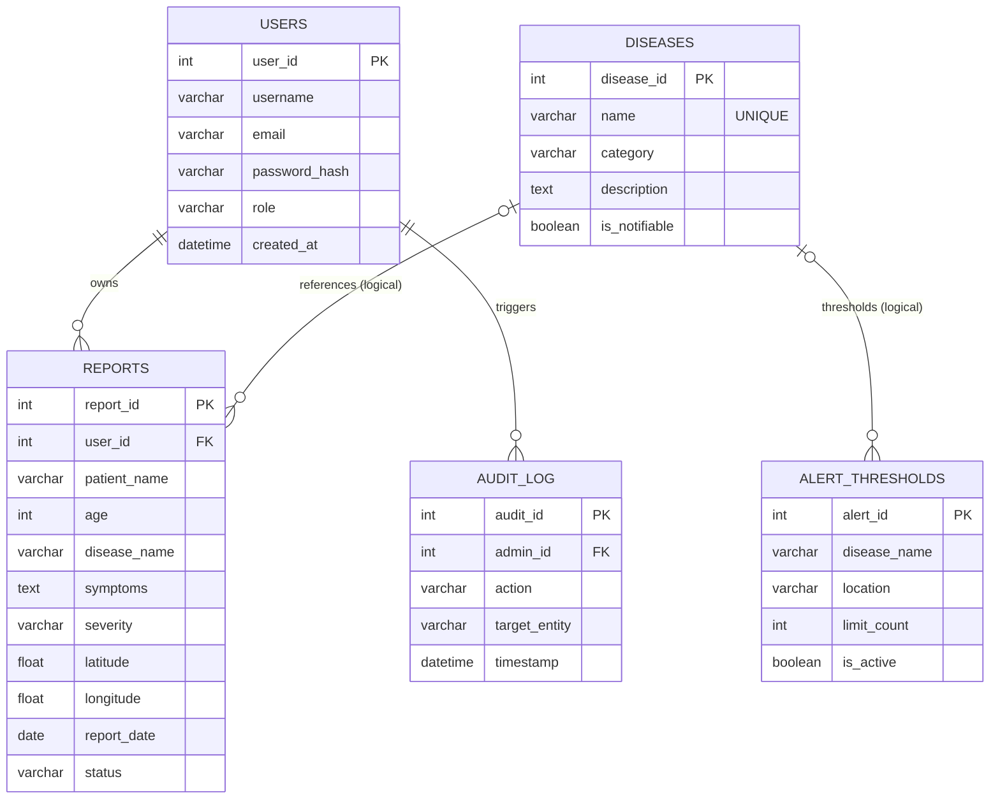
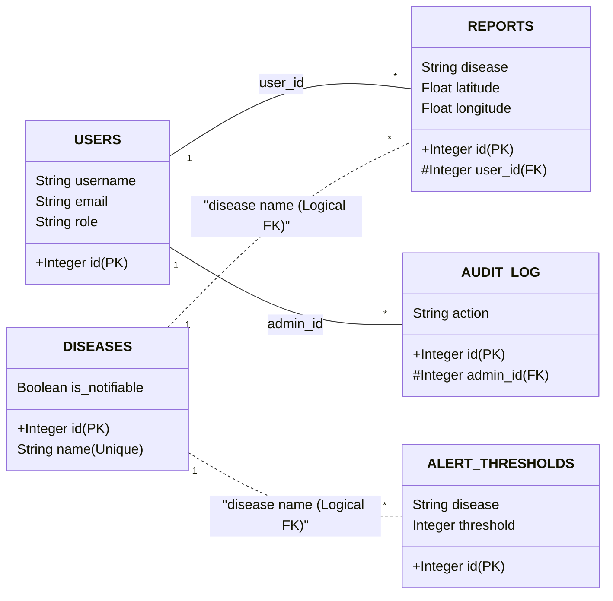

# Project Report: Pandemic Surveillance System

## 1. Project Overview
The **Pandemic Surveillance System** is a mission-critical, real-time health monitoring platform engineered to gather, analyze, and visualize disease outbreak data at a global scale. In an era of rapid pathogen transmission, this system provides a unified interface for healthcare professionals (frontline reporters) and national health administrators (strategic decision-makers). 

By automating the detection of case clusters through intelligently defined "Alert Thresholds," the system shifts public health response from *reactive* to *proactive*, potentially saving lives by identifying outbreaks before they escalate into pandemics.

---

## 2. Functional Requirements

### 2.1. For Healthcare Workers (Users)
- **Direct Reporting:** Securely submit patient incident reports including disease type, severity, and precise location.
- **Personal Dashboard:** Track personal reporting history and view aggregated local statistics.
- **Real-time Map:** Gain situational awareness of active outbreaks in their immediate vicinity.

### 2.2. For Health Administrators (Admins)
- **Global Surveillance:** Access a high-density, interactive world map visualizing over 180,000+ data points.
- **Disease Management:** Maintain the central registry of known diseases, categories, and "notifiable" statuses.
- **Alert Configuration:** Define custom threshold limits (e.g., "Alert if COVID-19 cases in Mumbai exceed 50 in 24 hours").
- **Audit Oversight:** Review a comprehensive audit trail of all administrative actions (verification, rejection, deletions).
- **User Management:** Authorize or deactivate clinical accounts to ensure data integrity.

---

## 3. Entity-Relationship (ER) Diagram
This diagram represents the logical data model using **Chen-style concepts in Crow's Foot notation**.

---

## 4. Relational Schema (Physical Model)
The following is the formalized relational model. Attributes underlined ($PK$) represent **Primary Keys**, and attributes prefixed with (#) represent **Foreign Keys**.

- **USERS** ($\underline{id}$, username, email, password_hash, role, is_active, created_at)
- **DISEASES** ($\underline{id}$, name, category, description, is_notifiable, created_at)
- **REPORTS** ($\underline{id}$, #user_id, patient_name, age, disease, symptoms, severity, location_city, location_state, location_country, latitude, longitude, report_date, status, notes, created_at)
- **ALERT_THRESHOLDS** ($\underline{id}$, disease, location, threshold, is_active, created_at)
- **AUDIT_LOG** ($\underline{id}$, #admin_id, action, target_table, target_id, details, timestamp)

### 4.1. Visual Relational Mapping

---

## 5. Security and Data Integrity

### 5.1. Cryptographic Hashing
User passwords are never stored in plain text. The system utilizes **PBKDF2 (Password-Based Key Derivation Function 2)** with a SHA-256 salt via the `Werkzeug` library. This ensures that even in the event of a database breach, user credentials remain computationally infeasible to decrypt.

### 5.2. Role-Based Access Control (RBAC)
The system strictly segregates permissions:
- **`user` role:** Limited to `POST` (submitting reports) and `GET` (viewing personal/global maps).
- **`admin` role:** Exclusive access to the `/admin` route, disease registry, and user management.

### 5.3. Audit Logs
Every sensitive administrative action (deleting a disease, verifying a report, changing a threshold) is automatically logged via the `AuditLog` model, recording the administrator's ID, the action taken, and the timestamp.

---

## 6. Relational Algebra
The following formalisms define the core data manipulation operations using relational algebra symbols.

### 6.1. Retrieve All Verified Reports for a Specific Disease
Operation: Selection ($\sigma$) 
$$\sigma_{\text{disease} = \text{'COVID-19'} \land \text{status} = \text{'verified'}}(REPORTS)$$

### 6.2. List Names of Doctors Reporting 'Severe' Cases
Operation: Selection ($\sigma$) followed by Natural Join ($\bowtie$) and Projection ($\pi$). 
$$\pi_{\text{username}}(USERS \bowtie_{\text{USERS.id} = \text{REPORTS.user\_id}} (\sigma_{\text{severity} = \text{'severe'}}(REPORTS)))$$

### 6.3. Find All Active Notifiable Viral Diseases
Operation: Compound Selection ($\sigma$) and Projection ($\pi$).
$$\pi_{\text{name, category}}(\sigma_{\text{is\_notifiable} = \text{True} \land \text{category} = \text{'viral'}}(DISEASES))$$

### 6.4. Cross-Reference Reports with Regional Thresholds
Operation: Equijoin between the dynamically generated count relation and current thresholds.
$$\text{Relation } C = \gamma_{\text{location\_city, disease, COUNT(id) AS count}}(REPORTS)$$
$$\pi_{\text{location\_city, disease}}(C \bowtie_{\text{C.disease} = \text{AT.disease} \land \text{C.count} > \text{AT.threshold}} ALERT\_THRESHOLDS)$$

---

## 7. Future Enhancements

### 7.1. Predictive AI Analysis
Integrating a Machine Learning layer (e.g., Prophet or LSTM) to predict future case counts based on historical trends stored in the database.

### 7.2. Global GIS Integration
Moving towards **PostGIS** for PostgreSQL to allow for true geo-spatial queries (e.g., "Find all cases within a 50km radius of this coordinate").

### 7.3. Real-time Notifications
Implementing WebSockets (Flask-SocketIO) to push "Pandemic Alerts" to active administrative browsers the second a threshold is breached.

---

## 8. Technical Stack Summary
- **Backend:** Flask (Python)
- **Database:** PostgreSQL (Production) / SQLite (Development)
- **ORM:** SQLAlchemy
- **Authentication:** Flask-Login + Werkzeug (Hashed Passwords)
- **Visualization:** Leaflet.js (Mapping), Chart.js (Analytics)

---

> [!TIP]
> This report reflects the current state of the production database deployed on Render. The schema is optimized for global scale, supporting over 180k+ records through bulk indexing and optimized relational joins.
